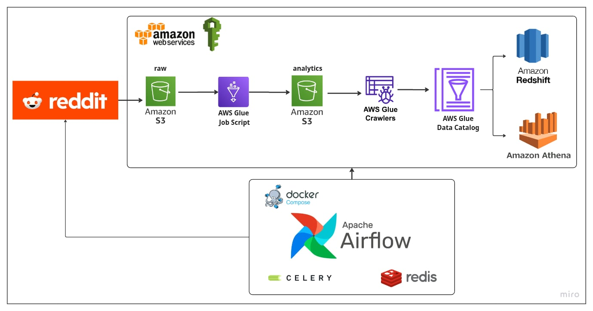

# 📊 Reddit API Data Pipeline

An end-to-end data engineering pipeline that extracts data from Reddit, orchestrates ETL workflows with Apache Airflow, and leverages AWS services for scalable data transformation, cataloging, and analytics.

## 🎯 Project Overview

This project demonstrates a production-ready data pipeline that:
- Extracts top posts and comments from Reddit's `/r/learnprogramming` subreddit using PRAW
- Orchestrates ETL workflows with Apache Airflow and Celery Executor
- Stores raw data in Amazon S3
- Transforms data using AWS Glue Jobs
- Catalogs processed data with AWS Glue Crawler
- Enables querying through Amazon Athena
- Supports optional loading into Amazon Redshift Serverless for analytics

## 🏗️ Architecture


### Workflow Steps

1. **Extract Reddit Data**: Connects to Reddit API via PRAW to extract top discussions and their top 5 comments
2. **Load to S3**: Cleans and type-casts data with Pandas, uploads to S3 `raw/` folder using s3fs
3. **Transform with Glue**: Triggers AWS Glue Job from Airflow to perform transformations (column merging, field removal)
4. **Catalog Data**: Runs AWS Glue Crawler to scan transformed data and update the Data Catalog for Athena queries

## 🛠️ Tech Stack

| Component | Technology | Purpose |
|-----------|-----------|---------|
| **Orchestration** | Apache Airflow 3.1.0 | Manages ETL workflow using Docker Compose |
| **Executor** | Celery Executor | Distributes tasks across multiple workers |
| **Message Broker** | Redis | Enables worker-scheduler communication |
| **Storage** | Amazon S3 | Stores raw and transformed datasets |
| **Transformation** | AWS Glue Job | Runs data transformations and cleaning |
| **Cataloging** | AWS Glue Crawler | Updates AWS Glue Data Catalog |
| **Query Engine** | Amazon Athena | SQL queries on transformed data |
| **Data Warehouse** | Amazon Redshift Serverless | Optional analytics and dashboarding |
| **API Client** | PRAW (Python) | Reddit API interactions |
| **AWS SDK** | Boto3 | AWS service operations |

## 📁 Project Structure

```
Reddit_Api_Data_Pipeline/
│
├── dags/                          
│   ├── main_dag.py                 
│   │
│   ├── etls/                       
│   │   ├── reddit_extract.py       
│   │   └── aws_etls.py             
│   │
│   ├── pipelines/                  
│   │   ├── extract_reddit.py       
│   │   └── aws_s3_pipeline.py      
│   │
│   ├── utils/                      
│   │   └── constants.py            
│   │
│   └── data/                       
│       ├── input/   
|       └── output/                 
│
├── config/                         
│   ├── airflow.cfg                 
│   └── config.conf                 
│
├── docker-compose.yaml             
├── Dockerfile                      
├── .env                            
├── requirements.txt                
│
├── plugins/                        
├── logs/                           
│
├── README.md                       
└── .gitignore                      
```

## 🔄 Airflow DAG Tasks

| Task ID | Description |
|---------|-------------|
| `extract_task` | Extracts top posts and comments from Reddit using PRAW |
| `upload_task` | Uploads extracted dataset to S3 `raw/` folder |
| `run_glue_job` | Executes AWS Glue Job for data transformation |
| `run_glue_crawler` | Runs AWS Glue Crawler to update data catalog |

**DAG Flow**: `extract_task` → `upload_task` → `run_glue_job` → `run_glue_crawler`

## 📦 S3 Bucket Structure

```
s3://<your-bucket-name>/
│
├── raw/
│   └── reddit_learnprogramming_<timestamp>.csv
│
├── analytics/
│   └── reddit_learnprogramming_cleaned_<timestamp>.csv
│
└── athena_scripts/
    └── queries/
```

## 📋 Data Schema

| Column | Type | Description |
|--------|------|-------------|
| `id` | String | Unique Reddit post identifier |
| `title` | String | Post title |
| `selftext` | String | Post body content |
| `score` | Integer | Post upvote count |
| `num_comments` | Integer | Total number of comments |
| `author` | String | Reddit username of post author |
| `subreddit` | String | Subreddit name (learnprogramming) |
| `subreddit_subscribers` | Integer | Total subreddit subscribers |
| `created_utc` | Timestamp | Post creation time (UTC) |
| `url` | String | Direct link to Reddit post |
| `over_18` | Boolean | NSFW content flag |
| `upvote_ratio` | Float | Ratio of upvotes to total votes |
| `comments` | Array/String | Top 5 comments on the post |
| `e-s-s` | String | Example of merged columns from transformations |

## 🚀 Getting Started

### Prerequisites

- Docker and Docker Compose installed
- AWS Account with permissions for S3, Glue, IAM, and Athena
- Reddit API credentials ([Create Reddit App](https://www.reddit.com/prefs/apps))

### Installation

1. **Clone the repository**
   ```bash
   git clone https://github.com/yourusername/Reddit_Api_Data_Pipeline.git
   cd Reddit_Api_Data_Pipeline
   ```

2. **Configure environment variables**
   
   Create a `.env` file in the project root:
   ```env
   # Reddit API Credentials
   REDDIT_CLIENT_ID=<your_reddit_client_id>
   REDDIT_SECRET=<your_reddit_secret>
   REDDIT_USER_AGENT=<your_user_agent>

   # AWS Credentials
   AWS_ACCESS_KEY_ID=<your_aws_access_key>
   AWS_SECRET_ACCESS_KEY=<your_aws_secret_key>
   AWS_REGION=<aws_region>
   S3_BUCKET_NAME=<your_s3_bucket_name>
   ```

3. **Start Airflow services**
   ```bash
   docker compose up -d
   ```

4. **Access Airflow UI**
   
   Navigate to `http://localhost:8080` in your browser
   
   Default credentials (if not changed):
   - Username: `airflow`
   - Password: `airflow`

5. **Trigger the DAG**
   
   Enable and manually trigger `reddit_data_pipeline_dag` from the Airflow UI

## 🔧 Configuration

Edit `config/config.conf` to customize:
- Subreddit to scrape
- Number of posts to extract
- Number of comments per post
- S3 bucket paths
- AWS Glue job names

## 📊 Querying Data with Athena

Once the pipeline completes, query your data in Athena:

```sql
SELECT 
    title,
    score,
    num_comments,
    author,
    DATE(from_unixtime(created_utc)) as post_date
FROM reddit_learnprogramming_analytics
WHERE score > 100
ORDER BY score DESC
LIMIT 10;
```

## 🎯 Future Enhancements

- [ ] Implement real-time streaming with AWS Kinesis or Apache Kafka
- [ ] Automate Redshift Serverless table creation and loading
- [ ] Add data quality validation with Great Expectations
- [ ] Build interactive dashboards using Amazon QuickSight
- [ ] Implement monitoring and alerting with CloudWatch
- [ ] Add unit and integration tests
